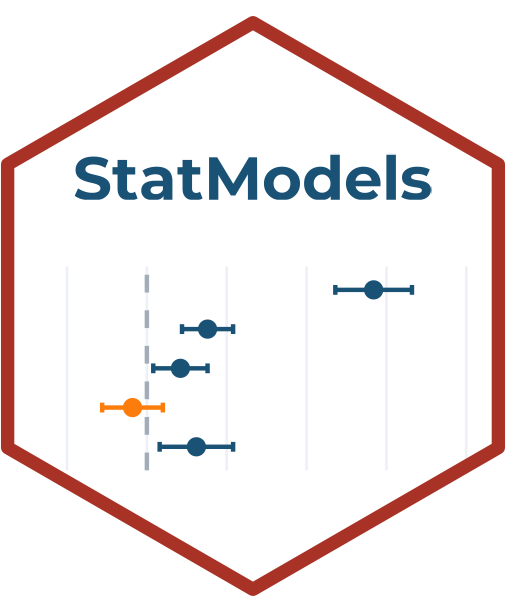

# StatModels 

<!-- badges: start -->
<!-- badges: end -->

**StatModels** es una plataforma interactiva de modelación estadística, parte del ecosistema [StatSuite](https://github.com/ManuelSpinola). Diseñada para enseñanza e investigación en ecología y ciencias de la biodiversidad.

## Módulos disponibles

| Módulo | Descripción | Estado |
|--------|-------------|--------|
| Modelo lineal (LM) | Regresión lineal simple, múltiple, ANOVA, ANCOVA | ✅ Disponible |
| Modelo lineal generalizado (GLM) | Logístico, Poisson, Binomial negativa | ✅ Disponible |
| Modelo aditivo generalizado (GAM) | Efectos no lineales con mgcv | ✅ Disponible |
| Modelos mixtos (LMM) | Efectos aleatorios con lme4 | ✅ Disponible |

## Instalación

```r
# Instalar desde GitHub
install.packages("remotes")
remotes::install_github("ManuelSpinola/StatModels")
```

## Uso

```r
library(StatModels)
StatModels::run_app()
```

## StatSuite

StatModels forma parte de **StatSuite**, un ecosistema de aplicaciones Shiny para análisis de datos ecológicos:

- **StatFlow** — Primeros pasos en análisis de datos
- **StatDesign** — Diseño de estudios y muestreo  
- **StatModels** — Modelación estadística ← esta app
- **StatGeo** — Análisis espacial y SIG
- **StatOccu** — Modelos de ocupación
- **StatMonitor** — Monitoreo de biodiversidad

## Autor

**Manuel Spínola**  
ICOMVIS · Universidad Nacional · Costa Rica

## Licencia

MIT
